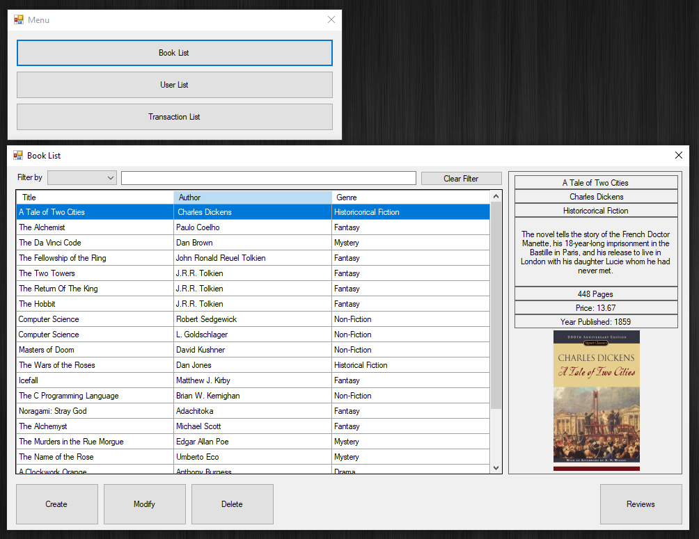

# Book Store System

This project was made in a group for a Component-Based Software Design course at Temple University.  
Users can create an account and login as Admins or Customers, and then epending on the account type users can add, modify, delete, or simply view books, reviews, users, and transactions.  
### karponick contributions:  
- Book system
- Review System  
### Other Contributors:
- Login system
- Transaction system

## Tools
- C#
- Visual Studio
- .NET
- ADO.NET
- MS Access
- Google Books API

## Screenshots
  

